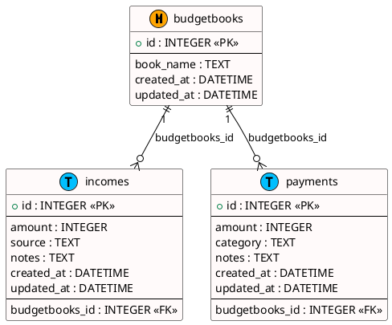

```plantuml
@startuml
!define MASTER_MARK_COLOR Orange 
!define TRANSACTION_MARK_COLOR DeepSkyBlue
skinparam BackgroundColor transparent
skinparam handwrittun True

skinparam class {
    BackgroundColor Snow
    BorderColor Black
    ArrowColor Black
}

entity "budgetbooks" as budgetbooks <<M,MASTER_MARK_COLOR>> {
    + id : INTEGER <<PK>>
    --
    book_name : TEXT
    created_at : DATETIME
    updated_at : DATETIME
}

entity "incomes" as incomes <<T,TRANSACTION_MARK_COLOR>> {
    + id : INTEGER <<PK>>
    --
    amount : INTEGER
    source : TEXT
    notes : TEXT
    created_at : DATETIME
    updated_at : DATETIME
    --
    budgetbooks_id : INTEGER <<FK>>
}

entity "payments" as payments <<T,TRANSACTION_MARK_COLOR>> {
    + id : INTEGER <<PK>>
    --
    amount : INTEGER
    category : TEXT
    notes : TEXT
    created_at : DATETIME
    updated_at : DATETIME
    --
    budgetbooks_id : INTEGER <<FK>>
}

budgetbooks ||--o{ incomes : "1" budgetbooks_id
budgetbooks ||--o{ payments : "1" budgetbooks_id

@enduml


```