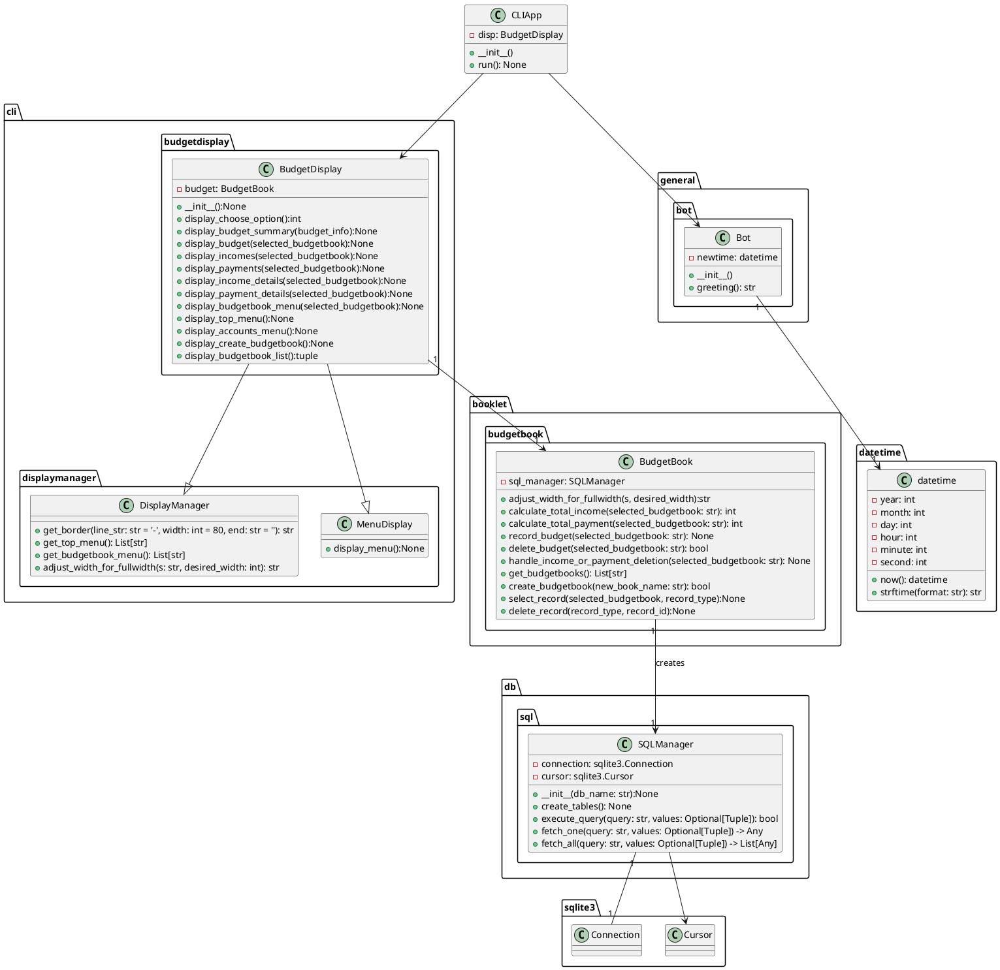

```plantuml

@startuml
class datetime.datetime {
    {field} - year: int
    {field} - month: int
    {field} - day: int
    {field} - hour: int
    {field} - minute: int
    {field} - second: int
    {method} + now(): datetime
    {method} + strftime(format: str): str
}
class sqlite3.Connection{}
class sqlite3.Cursor{}


class general.bot.Bot {
    - newtime: datetime
    + __init__()
    + greeting(): str
}


general.bot.Bot "1" --> "1" datetime.datetime

class booklet.budgetbook.BudgetBook {
    - sql_manager: SQLManager
    + adjust_width_for_fullwidth(s, desired_width):str
    + calculate_total_income(selected_budgetbook: str): int
    + calculate_total_payment(selected_budgetbook: str): int
    + record_budget(selected_budgetbook: str): None
    + delete_budget(selected_budgetbook: str): bool
    + handle_income_or_payment_deletion(selected_budgetbook: str): None
    + get_budgetbooks(): List[str]
    + create_budgetbook(new_book_name: str): bool
    + select_record(selected_budgetbook, record_type):None
    + delete_record(record_type, record_id):None
}


class db.sql.SQLManager {
    - connection: sqlite3.Connection
    - cursor: sqlite3.Cursor
    + __init__(db_name: str):None
    + create_tables(): None
    + execute_query(query: str, values: Optional[Tuple]): bool
    + fetch_one(query: str, values: Optional[Tuple]) -> Any
    + fetch_all(query: str, values: Optional[Tuple]) -> List[Any]
}


package cli {
    package displaymanager{
        class DisplayManager {
            + get_border(line_str: str = '-', width: int = 80, end: str = ''): str
            + get_top_menu(): List[str]
            + get_budgetbook_menu(): List[str]
            + adjust_width_for_fullwidth(s: str, desired_width: int): str
        }
        class MenuDisplay {
            + display_menu():None
        }
    }
    package budgetdisplay{
        class BudgetDisplay {
            - budget: BudgetBook
            + __init__():None
            + display_choose_option():int
            + display_budget_summary(budget_info):None
            + display_budget(selected_budgetbook):None
            + display_incomes(selected_budgetbook):None
            + display_payments(selected_budgetbook):None
            + display_income_details(selected_budgetbook):None
            + display_payment_details(selected_budgetbook):None
            + display_budgetbook_menu(selected_budgetbook):None
            + display_top_menu():None
            + display_accounts_menu():None
            + display_create_budgetbook():None
            + display_budgetbook_list():tuple
        }
    }
}

db.sql.SQLManager "1" -- "1" sqlite3.Connection
db.sql.SQLManager --> sqlite3.Cursor

BudgetDisplay --|> DisplayManager
BudgetDisplay --|> MenuDisplay
BudgetDisplay "1" --> "1" booklet.budgetbook.BudgetBook
booklet.budgetbook.BudgetBook "1" --> "1" db.sql.SQLManager:creates

class CLIApp {
    - disp: BudgetDisplay
    + __init__()
    + run(): None
}

CLIApp --> general.bot.Bot
CLIApp --> BudgetDisplay
@enduml

```